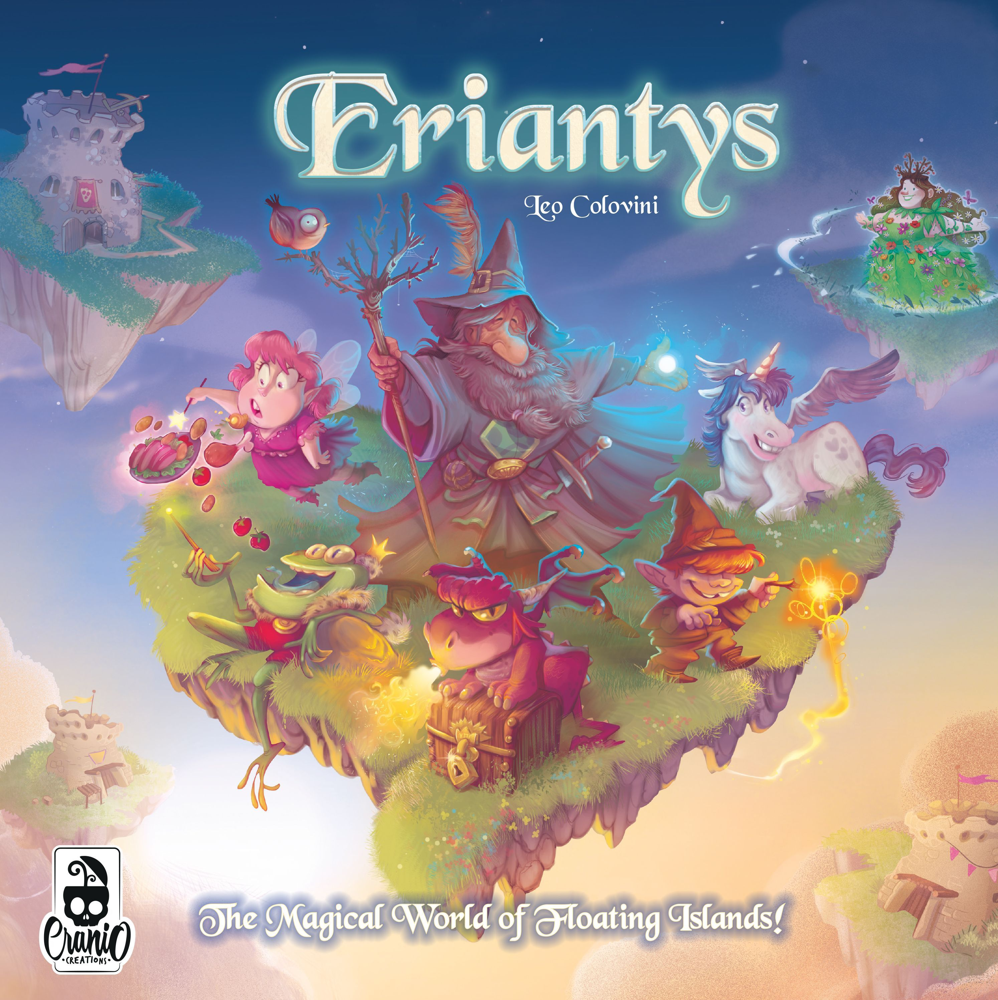

# Prova Finale di Ingegneria del Software - AA 2021/2022


Implementazione del gioco da tavolo [Eriantys](http://www.craniocreations.it/prodotto/eriantys/).

Il progetto consiste nell’implementazione, utilizzando il pattern MVC (Model-View-Controller), di un sistema distribuito composto da un singolo server in grado di gestire più partite alla volta e multipli client (uno per giocatore) che possono partecipare ad una sola partita alla volta.
La rete è stata gestita con l'utilizzo delle socket.

Interazione e gameplay: linea di comando (CLI) e interfaccia grafica (GUI).

## Componenti del gruppo
- [__Samuele Scherini__](https://github.com/ScheriniSamuele)
- [__Matteo Spreafico__](https://github.com/MattBlue00)
- [__Ludovica Tassini__](https://github.com/LudoTassini)

## Avvio dell'applicazione

Questo progetto richiede Java e JRE di versione 17 o superiore per poter essere eseguito correttamente.

Forniamo quattro file `jar` per lanciare l'applicazione:
- [__Server__](https://github.com/MattBlue00/ing-sw-2022-Scherini-Spreafico-Tassini/tree/main/deliveries/jar/server/x86-arm-m1)
- [__CLI__](https://github.com/MattBlue00/ing-sw-2022-Scherini-Spreafico-Tassini/tree/main/deliveries/jar/cli/x86-arm-m1)
- [__GUI__](https://github.com/MattBlue00/ing-sw-2022-Scherini-Spreafico-Tassini/tree/main/deliveries/jar/gui/x86) per architetture x86
- [__GUI__](https://github.com/MattBlue00/ing-sw-2022-Scherini-Spreafico-Tassini/tree/main/deliveries/jar/gui/arm-m1) per architetture ARM-M1

Generare due `jar` distinti per la GUI in base all'architettura della macchina è una necessità nata da dei problemi noti di integrazione delle librerie grafiche di JavaFX per architetture diverse con il tool Maven.

I `jar` del server e della CLI si lanciano da terminale tramite il comando:
```
java -jar nome_jar.jar
```
I `jar` della GUI possono essere lanciati anche
con un doppio click sull'icona del file, oltre che da terminale (nello stesso modo mostrato sopra). Si noti che, utilizzando macOS, il doppio click potrebbe non funzionare al primo tentativo, dato che non siamo sviluppatori certificati da Apple. Per risolvere il problema, è sufficiente avviare l'applicazione per la prima volta cliccando il tasto destro del mouse sopra l'icona dell'app e selezionando Apri.

## Documentazione

### UML
I seguenti diagrammi delle classi rappresentano rispettivamente il progetto iniziale sviluppato durante le prime settimane di laboratorio e il prodotto finale.
- [__UML iniziale__](https://github.com/MattBlue00/ing-sw-2022-Scherini-Spreafico-Tassini/blob/main/deliveries/uml/InitialUML.pdf)
- [__UML finale__](https://github.com/MattBlue00/ing-sw-2022-Scherini-Spreafico-Tassini/blob/main/deliveries/uml/FinalUML.png)

Ulteriori diagrammi delle classi più dettagliati, riguardanti il progetto finale, si possono consultare [qui](https://github.com/MattBlue00/ing-sw-2022-Scherini-Spreafico-Tassini/tree/main/deliveries/uml/detailed_uml).

### Librerie e Plugins
| Libreria/Plugin | Descrizione                                                                              |
|-----------------|------------------------------------------------------------------------------------------|
| __Maven__       | Strumento di automazione della compilazione utilizzato principalmente per progetti Java. |
| __JavaFX__      | Libreria grafica per realizzare l'interfaccia utente (GUI).                              |
| __JUnit__       | Framework di unit testing.                                                               |

### Test coverage

| Package        | Class coverage | Method coverage | Line coverage |
|----------------|----------------|-----------------|---------------|
| __Model__      | 100% (30/30)   | 93% (185/197)   | 85% (799/932) |
| __Controller__ | 100% (6/6)     | 81% (52/64)     | 53% (274/514) |

Si noti che le classi che compongono il Controller contengono molti metodi utili per le View, e dunque tali metodi
non sono stati testati. Questa è la ragione dietro le basse percentuali della coverage del Controller. Inoltre, per 
evitare percentuali troppo falsate, è stata rimossa dal conto della coverage un'intera classe composta solo da metodi
utili per le View.

## Funzionalità

### Funzionalità sviluppate
- Regole normali e variante per esperti
- CLI
- GUI
- Socket
- 2 FA (Funzionalità avanzate):
    - __12 carte personaggio:__ tutte le carte personaggio previste dall'edizione fisica del gioco sono state implementate nel software. 
    - __Partite multiple:__ il server può gestire più partite contemporaneamente.

### Nota aggiuntiva

Il regolamento del gioco fornito presenta la seguente regola riguardo al controllo di un'isola:
> Se Madre Natura termina il suo movimento su un'Isola dove non c'è
ancora una Torre, il giocatore con più influenza ne posizionerà una,
prendendo il controllo dell'Isola.
Per calcolare l'influenza, contate il numero di Studenti su quell'Isola
corrispondenti ai colori dei Professori controllati da ciascun giocatore.
Se avete più influenza del vostro avversario, dovete piazzare sull'Isola
una Torre presa dalla vostra plancia Scuola. Se è il vostro avversario
ad avere più influenza, allora sarà lui a costruire una Torre. Se la vostra
influenza è pari, non viene piazzata alcuna Torre.

Abbiamo assunto che l'isola potesse essere controllata solo dal giocatore che sposta Madre Natura,
a patto che abbia l'influenza necessaria.

